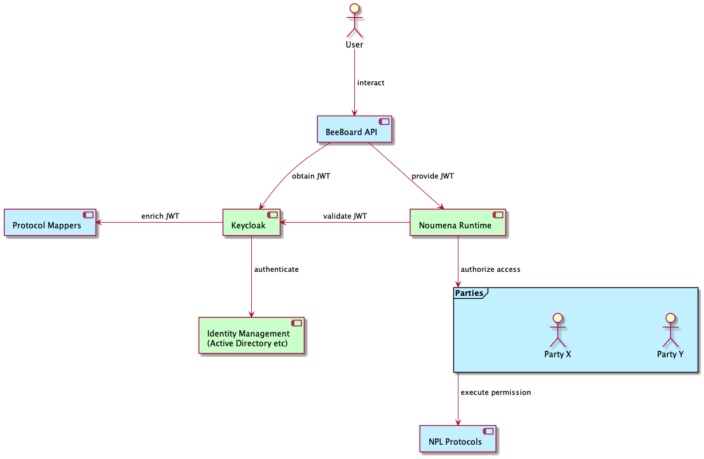
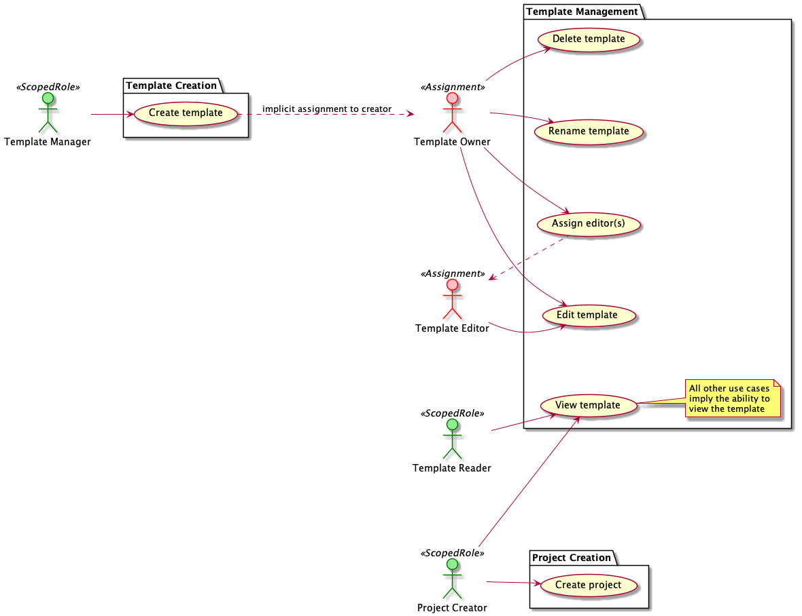
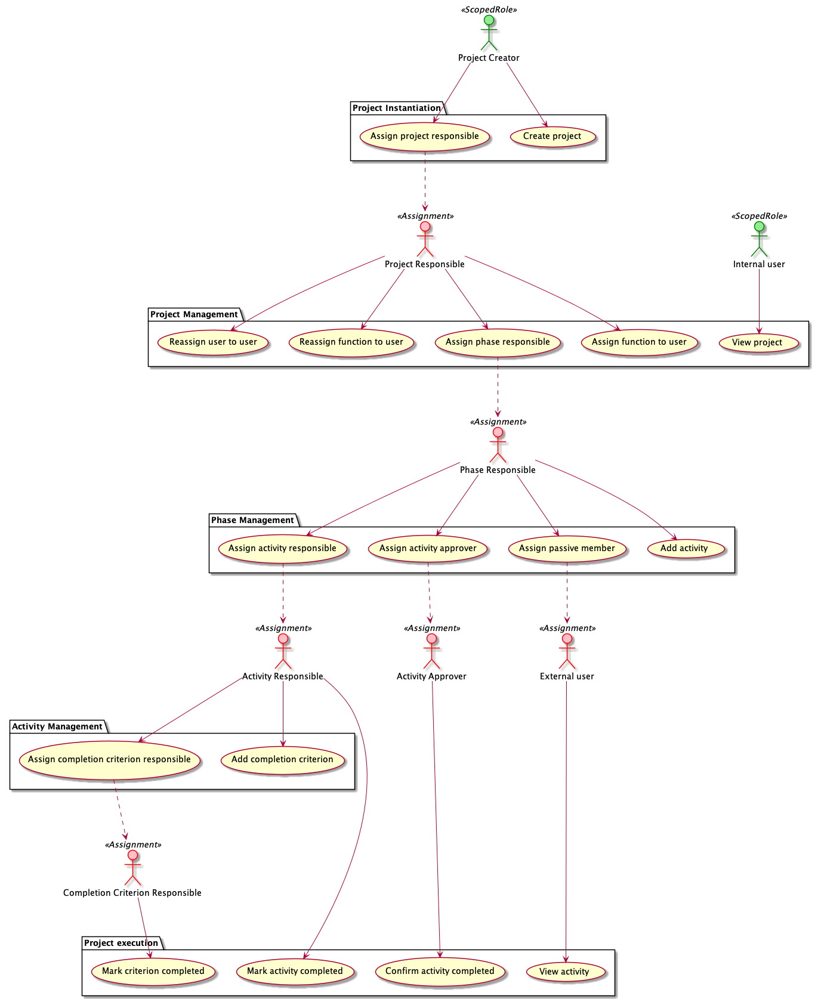
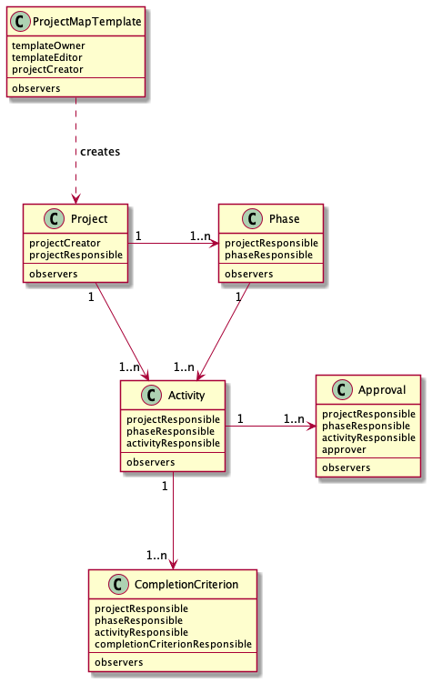

# BeeBoard Authorization: Proposal

This document is a design proposal on how to implement authorization on templates and projects in the BeeBoard project. 

## References

* [Use Cases (LucidChart)](https://lucid.app/lucidchart/cc7c7935-27ad-4c80-b0c0-1e3477ca6ba8/edit)
* [Write up on Roles (Confluence)](https://deck2.atlassian.net/wiki/spaces/DECK2/pages/58523649/Auth+requirements+Roles+project+roles+and+functions#1.-Roles-(administrative-Rollen))

## Design considerations

This proposal deals with the following considerations: 

* **Use cases:** the design _should_ support all use cases explained in the references 
* **Transparency:** given a template or project, it _should_ be straightforward to determine who has access. 
* **Standards:** the design _should_ use the preferred approach from the Noumena platform.   
* **Efficiency:** determining access _should_ be fast; and the JWT _should_ be as small as possible

Note that these considerations can conflict with each other. 

## Relevant components

The following diagram shows an overview of the various components involved when authenticating and authorizing users. 

The blue parts are part of our application; the green parts are provided technology which we can not change. 


                                                  
The primary components are: 
* BeeBoard API – Primary entrypoint for interacting with the system
* NPL Protocols – Business logic for managing the BeeBoard templates and projects through permissions
* Parties – Logical entities that call permissions

All of this is supported by: 
* Identity Management – Underlying system providing authentication, for example an Active Directory instance
* Keycloak – Proxy for various identity management systems; provides and validates JWTs
* Protocol Mappers - (Custom) extensions to add extra data to JWTs 
* Noumena Runtime – Runtime for NPL Protocols; manages authorization on protocols

## Primary Questions

Based on the components in the previous sections, this document should  answer the following questions: 

* Which **parties** are involved in the system? 
* By what mechanism are **users** mapped to these **parties**? 

## General Requirements

This section restates the requirements in such a way that they can be mapped to technical concepts and implementations.
This is not an exhaustive description of the requirements; refer to the References above for a more in-depth 
description of these requirements. 

### Mechanisms

There are three mechanisms to give users specific rights: **Scopes**, **Roles** and **User assignments**. 

#### Scopes

Scopes provide a tenant-specific mechanism to group users and use those groups to give users permissions; 
in other words, use those groups to map those users to their associated parties. 

For now, we distinguish the following scopes:

* **Location** 
* **Business Unit**
* **Special** 

Next to that, we have the **Restricted** scope which provides invitation-only access. 

**Note:** the use case documents distinguish "dimensional" scopes from special scopes. From a technical
perspective there is no need to distinguish them; the API and UI might still treat them differently.

**Note:** the use case documents explicitly mention the notion of "hierarchical scopes". On a technical level we only
deal with the leaf scopes. Refer to the section [Hierarchical Scopes](#hierarchical-scopes) on how to match the
use case with the technical implementation.

#### Roles

Roles provide a general mechanism to give users permissions. They are orthogonal to scopes; and the 
final permissions of a user are determined by the combination of roles and scopes. 

Whereas the values of scopes can vary per tenant, **Roles** are defined on the application level.

#### Assignments

Assignments are a simple matter of assigning a specific user to a specific party. They are mutually exclusive 
with scopes and roles. 

### Templates

The following diagram summarizes the various use cases described in the LucidChart documents. 



Green actors are determined by scopes and roles. Red actors are determined by explicit assignments; dotted arrows
indicate the source of these explicit assignments. 

* TemplateManager: determined by having the role `template-manager` and matching scopes. 
* TemplateReader: determined by having the role `template-reader` and matching scopes. 
* ProjectCreator: determined by having the role `project-creator` and matching scopes.

### Projects

The following diagram summarizes the various use cases described in the LucidChart documents. 



Green actors are determined by scopes and roles. Red actors are determined by assignments; dotted arrows
indicate the source of these assignments. 

* ProjectCreator: see above
* Internal User: determined by having the role `project-reader` and matching scopes.  

Not shown in the diagram is the fact rights "bubble up": if you can assign a responsible and/or approver, you can also
execute all actions of that responsible and/or approver. For example, a Project Responsible can also add a completion
criterion. 

Also not shown in the diagram: assignment can either be done directly by specifying a user, or indirectly by specifying
a function.   

### ScopedRole: Scopes per Role 

A user can have different scopes for different roles. For example, it's possible to have the role
Project Creator in scopes A and B, while having the role Project Reader in scopes A, B, C and D.
 
## Implementation Proposal 

### Protocols and Parties

The various NPL parties follow directly from use cases. Involvement of the various parties also implies most 
of the NPL Protocols.



The use case actors "Template Reader" and "External User" are not mentioned as such in the diagram. They are 
implemented using NPL observers.

The use case "Create Template" is also not present in the diagram. This use case is discussed below in the 
section [Responsibilities](#responsibilities)


### General implementation: Phase 1

The goal of this proposal is to follow [the structure provided by the Noumena Runtime (TODO: link to documentation)]().
This structure models a party assignment as a combination of an **entity** part and an **access** part. Incoming JWTs
are matched with both the entity and the access part. If both match, the runtime allows the caller to act as that 
party.  

The **entity** part defines the 'owner' of the party assignment; this document proposes to use the `iss` (issuer) field 
for that, since it directly related to the Keycloak realm that created the JWT. 

For the **access** part this document proposes to map each scope to a (non-standard) JWT claim; and to map roles 
to a JWT claim as well. Adding these values to the JWT is done using Keycloak protocol mappers.  

**PoC:** At this point the interaction between Keycloak federation to external Identity Management systems (such as
Active Directory) and application-specific protocol mappers is not clear. We should do a PoC where we federate to
our own AD and play around with these protocol mappers.

Above we defined the following types of authorization:

* Direct user assignment
* Indirect user assignment (through a function)
* Scope/Role-based user assignment 


### Direct user assignment

For direct user assignment, the proposal is to use the `email` field. This is straightforward. A direct assignment as
phase responsible for the user 'yigal@coregrid.com' would match the following JWT:

```json
{
  "email": "yigal@coregrid.com"
}
```
to a phase with party assignments like:

```json
{
  "phaseResponsible": {
    "access": {
      "email": ["yigal@coregrid.com"]
    }
  }
}
```

### Indirect user assignment

Indirect user assignment is the assignment to users via functions (and sub-functions). There are two solutions
for indirect user assignment:

1. Create project-specific `function` claims in the user's JWT which can be used to provide access.
2. Explicitly convert function assignments to direct user assignments.

The first option seems to be the easiest, but it has two major drawbacks: first, it makes the size of the JWTs
uncontrollable since we don't have an upper bound in functions; furthermore, it does not easily generalize to
sub-functions.

Converting function assignments to direct user assignments has the drawback that (re)assigning users can be a costly
operation, depending on the number of protocols. The advantage is that checking access to a specific protocol becomes
very simple.

This design proposes to convert function assignment to direct user assignments.

### Scoped role

For ScopedRole access every scope translates to a role-related claim in the JWT, whose values are the relevant 
scope and role values for that user in that role. For example, the user with role `Template Reader` in `Düsseldorf` 
will have the claim

```json
{
  "templateReaderLocations": ["düsseldorf"]
}
```

This will match a template with party claims like:

```json
{
  "observers": {
    "default": {
      "access": {
        "templateReaderLocations": ["düsseldorf", "köln"]
      }
    }
  }
}
```

(Entity claims omitted for simplicity)

The full set of claims will be:

* `templateManagerLocations`
* `templateManagerBusinessUnits`
* `templateManagerSpecial`
* `templateReaderLocations`
* `templateReaderBusinessUnits`
* `templateReaderSpecial`
* `projectCreatorLocations`
* `projectCreatorBusinessUnits`
* `projectCreatorSpecial`
* `projectReaderLocations`
* `projectReaderBusinessUnits`
* `projectReaderSpecial`

### Hierarchical scopes
<a name="hierarchical-scopes"></a>

Whatever design we choose, hierarchical scopes are a problem. This proposal moves the definition of the hierarchy 
to the API; actual authorization is always done on the leaf nodes of these hierarchies.
For example, the location scope *NRW* translates to the list *Köln*, *Düsseldorf*.

For example, the location scope "All locations" translates to the list Köln, Düsseldorf, Leipzig, Berlin. 

This does mean that adding a new scope value will require changes to all relevant templates. This is a 
significant driver to have the API be responsible for maintaining the hierarchical structure.

### Responsible, Approvers, Information 

There are three kinds of people involved with individual activities and completion criteria. The first is the 
Responsible, which is always a single actor with a user assignment. 

The second are the Information actors, which are implemented as observers. 

The final one is the Approver, which is a problematic role: an Activity can have _multiple_ approvers, and they
_all_ need to approve an activity before the entire activity can be considered approved. However, parties other 
than observers in the end always map to a _single_ actor. 

There are two ways to solve this. 

1. Have a separate party for each approver (i.e. `approver1`, `approver2` etc.), with an upper bound of five approvers
   (as confirmed by Jörg). This is of course ugly, and does not necessarily solve the problem that in NPL we still
   need to _count_ the approvers, and deal with the fact that an activity does not necessarily have all five approvers. 
2. Implement the _approval process_ as a separate protocol, with a separate instance for each approver. 

The second solution requires no upper bound, and makes sense from a conceptual point of view: the protocol serves 
as a _contract_ between the approver and the project, where the approver has the _obligation_ to approve 
(or not approve) the activity. 


### Responsibilities

With all the parties in place, it is clearly the responsibility of NPL (and the Noumena Runtime) to enforce the 
various rights. However, there are a few subjects with less clearly defined responsibilities: 

* **party-assignment** – determining the logic that ties a user to a party
* **scope management** – the location of the 'master' list of all available scopes and validation with respect to
  adding scopes to users, templates and projects
* **function management** – the (1-1) mapping of functions to users within a project, and the party assignment that 
  follows from these function assignments. 

This document proposes that everything related to party assignment is done within NPL, since many party assignments
are intertwined with business logic (especially when dealing with functions). 

**RFC** Managing party assignments from NPL is currently not possible. The examples below assume it _is_ and we 
will provide a relevant RFC. 

Scope values should not have any meaning within the context of NPL itself, so it can be argued that scope value
management resides outside NPL; and the API is the most likely candidate to contain this functionality. See
also the point about [hierarchical scopes](#hierarchical-scopes) above.

Function _management_ remains the prerogative of NPL; assigning users to functions and assigning functions to parties
is part of the API. 
   
### Unassigned parties 

NPL assumes that every party has an initial assignment. Since we control the valid issuer(s), the proposal is to use 
sentinel value that will never match for such assignments. For example:

```json
{
  "unassignedParty": {
    "entity": {"iss":  "http://keycloak:11000/realms/coregrid"},
    "access": {
      "sentinel": ["required"]
    }
  }
}
```

## Use Case: Lüddemann AG

Note: in all examples, the `entity` part has been omitted since it's always the same. 
            
### Scopes

* Locations (represented by the claim `location`): Leipzig, Berlin, Köln, Düsseldorf.
  The non-leaf location NRW contains both Köln and Düsseldorf. 
* Business Units (represented by the claim `businessUnit`): PM and IDS
* Special (represented by the claim `special`): "Kritische Infrastruktur"

### People

#### Maxima Musterfrau

A template reader in location NRW (Köln, Düsseldorf), business unit PM. Has access to special scope "Kritische
Infrastruktur"

```json
{
  "name": "Maxima Musterfrau",
  "iss": "http://keycloak:11000/realms/coregrid",
  "email": "maxima.musterfrau@coregrid.com",
  "templateReaderLocations": [
    "köln",
    "düsseldorf"
  ],
  "templateReaderBusinessUnits": [
    "pm"
  ],
  "templateReaderSpecial": [
    "kritische infrastruktur"
  ]
}
```

#### Max Mustermann

A template reader in location NRW, business unit IDS. Has access to special scope "Others".

```json
{
  "name": "Max Mustermann",
  "iss": "http://keycloak:11000/realms/coregrid",
  "email": "max.mustermann@coregrid.com",
  "templateReaderLocations": [
    "köln",
    "düsseldorf"
  ],
  "templateReaderBusinessUnits": [
    "ids"
  ],
  "templateReaderSpecial": [
    "others"
  ]
}
```

#### Justus Jonas

A template manager in location NRW, business unit IDS

```json
{
  "name": "Justus Jonas",
  "iss": "http://keycloak:11000/realms/coregrid",
  "email": "maxima.musterfrau@coregrid.com",
  "templateManagerLocations": [
    "köln",
    "düsseldorf"
  ],
  "templateManagerBusinessUnits": [
    "ids"
  ],
  "templateReaderLocations": [
    "köln",
    "düsseldorf"
  ],
  "templateReaderBusinessUnits": [
    "ids"
  ]
}
```

#### Maike Meisner

A template manager in location NRW, business unit PM, with special rights to be an editor on T2.

```json
{
  "name": "Maike Meisner",
  "iss": "http://keycloak:11000/realms/coregrid",
  "email": "maike.meisner@coregrid.com",
  "templateManagerLocations": [
    "köln",
    "düsseldorf"
  ],
  "templateManagerBusinessUnits": [
    "pm"
  ],
  "templateReaderLocations": [
    "köln",
    "düsseldorf"
  ],
  "templateReaderBusinessUnits": [
    "pm"
  ]
}
```

#### Maike Meisner (2)

Not to be confused with Maike Meisner. Special rights to be an editor on T4.

```json
{
  "name": "Maike Meisner",
  "iss": "http://keycloak:11000/realms/coregrid",
  "email": "maike.meisner2@coregrid.com"
}
```

#### Gundula Kleber

Project creator in IDS/Köln and PM/NRW.

```json
{
  "name": "Gundula Kleber",
  "iss": "http://keycloak:11000/realms/coregrid",
  "email": "gundula@coregrid.com",
  "projectCreatorLocations": [
    "köln",
    "düsseldorf"
  ],
  "projectCreatorBusinessUnits": [
    "ids",
    "pm"
  ],
  "templateReaderLocations": [
    "köln",
    "düsseldorf"
  ],
  "templateReaderBusinessUnits": [
    "ids",
    "pm"
  ]
}
```

#### Heinz Vogel

Project creator, IDS/Köln

```json
{
  "name": "Heinz Vogel",
  "iss": "http://keycloak:11000/realms/coregrid",
  "email": "heinz@coregrid.com",
  "projectCreatorLocations": [
    "köln"
  ],
  "projectCreatorBusinessUnits": [
    "ids"
  ],
  "templateReaderLocations": [
    "köln"
  ],
  "templateReaderBusinessUnits": [
    "ids"
  ]
}
```

#### Others 

All other users mentioned are identified by their e-mail address. So for example, Mara Schumacher would be: 

```json
{
  "name": "Mara Schumacher",
  "iss": "http://keycloak:11000/realms/coregrid",
  "email": "mara@coregrid.com"
}
```


### Templates

#### T1: Dimensional scope: All locations & all business units.

Using "all" for a dimensional scope removes the entire scope from the access claim. Anyone with role 'editor' or 'admin'
within the coreGrid organisation can edit this template. Anyone within coreGrid can view this template.

```json
{
  "templateManager": {
    "templateManagerLocations": ["köln", "düsseldorf", "leipzig", "berlin"],
    "templateManagerBusinessUnits": ["pm", "ids", "bu1", "bu2"]
  },
  "templateOwner": {
    "email": ["jörg@coregrid.com"]
  },
  "templateEditor": {
    "email": ["jörg@coregrid.com"]
  },
  "projectCreator": {
    "projectCreatorLocations": ["köln", "düsseldorf", "leipzig", "berlin"],
    "projectCreatorBusinessUnits": ["pm", "ids", "bu1", "bu2"]
  },
  "observers": {
    "default": {
      "templateReaderLocations": ["köln", "düsseldorf", "leipzig", "berlin"],
      "templateReaderBusinessUnits": ["pm", "ids", "bu1", "bu2"] 
    }
  }
}
```

Matches:

* Maxima Musterfrau: observer (user story 1.1)
* Max Mustermann: observer
* Justus Jonas: observer
* Maike Meisner: observer
* Maike Meisner (2): no access
* Gundula Kleber: observer, projectCreator
* Heinz Vogel: observer, projectCreator
* Others: no access

#### T2: Dimensional scope: Köln, IDS

```json
{
  "templateManager": {
    "templateManagerLocations": ["köln"],
    "templateReaderBusinessUnits": ["ids"]
  },
  "templateOwner": {
    "email": ["jörg@coregrid.com"]
  },
  "templateEditor": {
    "email": ["maike.maisner@coregrid.com"]
  },
  "projectCreator": {
      "projectCreatorLocations": ["köln"],
      "projectCreatorBusinessUnits": ["ids"]
  },
  "observers": {
    "default": {
      "templateReaderLocations": ["köln"],
      "templateReaderBusinessUnits": ["ids"]
    }
  }
}
```

Matches:

* Maxima Musterfrau: no access (user story 2.1)
* Max Mustermann: observer (user story 2.2)
* Justus Jonas: observer, templateManager (user story 2.3)
* Maike Meisner: explicitly assigned as template editor on T2 (user story 2.4)
* Maike Meisner (2): no access
* Gundula Kleber: observer, projectCreator
* Heinz Vogel: observer, projectCreator
* Others: no access

#### T3: Special scope Kritische Infrastruktur

```json
{
  "templateManager": {
    "templateManagerSpecial": ["kritische infrastruktur"]
  },
  "templateOwner": {
    "email": ["jörg@coregrid.com"]
  },
  "templateEditor": {
    "email": ["maike.maisner@coregrid.com"]
  },
  "projectCreator": {
    "projectCreatorSpecial": ["kritische infrastruktur"]
  },
  "observers": {
    "default": {
      "projectReaderSpecial": ["kritische infrastruktur"]
    }
  }
}
```

Matches:

* Maxima Musterfrau: observer (user story 3.1)
* Max Mustermann: no access (user story 3.2)
* Justus Jonas: no access
* Maike Meisner: editor (user story 3.3)
* Maike Meisner (2): no access
* Gundula Kleber: no access
* Heinz Vogel: no access
* Others: no access

#### T4: Restricted scope

```json
{
  "templateOwner": {
    "email": ["jörg@coregrid.com"]
  },
  "templateEditor": {
    "email": ["maike.meisner2@coregrid.com"]
  },
  "projectCreator": {
    "sentinel": ["required"]
  },
  "observers": {
  }
}
```

**Note:** The use case has not invited anyone as a project-creator. In order to prevent access, the sentinel claim
is used.

Matches:

* Maxima Musterfrau: no access
* Max Mustermann: no access
* Justus Jonas: no access
* Maike Meisner: no access
* Maike Meisner (2): templateEditor (user story 4.1)
* Leo Lumberjack: no access

### Projects

#### Gundula Kleber creates a project based on T2 with project scopes IDS/Köln

Gundula Kleber has project creator access on T2 (see above). Validating that the project scopes are a subset of
Gundula's scopes is done by NPL. Gundula immediately assigns Mara Schumacher as project responsible. 

The project ends up with the following party assignments:

```json
{
  "projectCreator": {
    "email": ["gundula@coregrid.com"]
  },
  "projectResponsible": {
    "email": ["mara.schumacher@coregrid.com"]
  },
  "observers": {
    "default": {
      "projectReaderLocations": ["köln"],
      "projectReaderBusinessUnits": ["ids"]
    }
  }
}
```

Creating the project will also create phases, activities and completion criteria. Each party assignment not yet
mentioned will be assigned the sentinel value. For example, one of the completion
criteria might have the following party assignment:

```json
{
  "projectResponsible": {
    "email": ["gundula@coregrid.com"]
  },
  "phaseResponsible": {
    "sentinel": ["required"]
  },
  "activityResponsible": {
    "sentinel": ["required"]
  },
  "completionCriterionResponsible": {
    "sentinel": ["required"]
  }
}
```
       
As a prototype: 

```npl
 package prototype.create_project

 struct PhaseTemplate {
     title: Text
 }

 protocol[projectCreator, irrelevantOtherParties] ProjectMapTemplate() {

     var phaseTemplates = listOf<PhaseTemplate>(
         PhaseTemplate { title: "phase 1" }
         PhaseTemplate { title: "phase 2" }
     );

     // createProject creates a new project based on this template. The new project will have
     // the specified title. The person with the e-mail address responsible will be the project responsible.  
     permission[projectCreator & *initialResponsible] createProject(title: Text, inScopes: Map<Text, Set<Text>>) returns Project {
         // double-check that the project scopes are a subset of the caller's scopes
         guard(inScopes.isNotEmpty(), "no scopes defined");
         guard(inScopes.allMatch(\(scope: Text, values: Set<Text>) returns Boolean -> {
             var callerScopeValues = projectCreator.access().get(scope);
             return true; // you get the picture
         }), "invalid scope");

         // define parties

         // special "no access" claim, basically a sentinel value
         var pNoAccess = projectCreator.withAccess(
             mapOf(Pair { first: "sentinel", second: setOf("required") })
         );
         // or preferable: pNoAccess = projectCreator.withoutAccess()

         // special read claim for "normal" users
         var colleagues = projectCreator.withAccess(
             inScopes // project scopes define read access
         );
         var observerMap = mapOf(Pair { first: "default", second: colleagues });

         // create the phases
         var phases = this.phaseTemplates.map(\(phaseTemplate: PhaseTemplate) returns Phase -> {
             // when creating a project, we have no explicit phase responsible
             var phase = Phase[initialResponsible, pNoAccess, observers = observerMap](phaseTemplate.title);
             return phase;
         });

         // same idea for activities and completion criteria
         // ... 

         // create the project
         var project = Project[initialResponsible, observers = observers](title, phases);
         return project;
     }
 }

 protocol[projectResponsible] Project(title: Text, phases: List<Phase>) {
 }

 protocol[projectResponsible, phaseResponsible] Phase(title: Text) {

     permission[projectResponsible & *newPhaseResponsible] setPhaseResponsible(responsible: Text) {
         phaseResponsible = newPhaseResponsible;

         // recurse to underlying activities and completion criteria
     }
 }

 function Example() {
     var projectCreator: Party = 'heinz.vogel';
     var projectResponsible: Party = 'mara.schumacher';
     var others: Party = '...';

     var template = ProjectMapTemplate[projectCreator, others]();
     var project = template.createProject[projectCreator, projectResponsible]("title", mapOf<Text, Set<Text>>().with("projectReaderLocations", setOf("dusseldorf")));

     // at this point, mara.schumacher is the project responsible
 }
```

#### Mara assigns Franz Fuchtel to the function Projectentwicklung
                       
For every phase, activity, approval and completion criterion where a function is assigned, a direct user assignment
is created. 

As a prototype for the 'responsible' function: 

```npl
package prototype.assign_function;

const functionA = "ProjectEntwicklung"
const functionB = "B"
const functionC = "C"

protocol[projectResponsible] Project() {
    var phases = listOf(
        Phase(optionalOf(functionA), setOf(functionC), listOf(
            Activity(optionalOf(functionA)),
            Activity(optionalOf(functionB))
        ))
    );

    var functions = mapOf<Text, Text>(); // function ID -> email

    permission [projectResponsible & *target] assignFunction(f: Text) {
        functions = functions.with(f, target.access().getOrFail("email"));
        phases.forEach(\(p: Phase) -> {
            p.setFunction[projectResponsible, target](f);
        });
    }
}

protocol[projectResponsible, phaseResponsible] Phase(
    var responsibleFunction: Optional<Text>,
    var informationFunction: Set<Text>,
    var activities: List<Activity>
) {

    permission[projectResponsible & *target] setPhaseResponsible() {
        phaseResponsible = target;

        // recurse to underlying activities
        activities.forEach(\(a: Activity) -> { a.setPhaseResponsible[projectResponsible, target](); });
    }

    permission[projectResponsible & *target] setFunction(f: Text) {
        if (responsibleFunction.isPresent() && responsibleFunction.getOrFail() == f) {
            phaseResponsible = target;
        };
        if (informationFunction.contains(f)) {
            var key : Text = target.access().getOrFail("email");
            observers = observers.with(key, target);
        };

        // recurse to activities 
        activities.forEach(\(a: Activity) -> { a.setFunction[projectResponsible, target](f); });
    }

}

protocol[projectResponsible, phaseResponsible, activityResponsible] Activity(
    var responsibleFunction: Optional<Text>
) {

    permission[phaseResponsible & *target] setPhaseResponsible() {
        phaseResponsible = target;
    }

    permission[projectResponsible & *target] setActivityResponsible(email: Text) {
        activityResponsible = target;

        // recurse to completion criteria
    }

    permission[projectResponsible & *target] setFunction(f: Text) {
        if (responsibleFunction.isPresent() && responsibleFunction.getOrFail() == f) {
            activityResponsible = target;
        };

        // recurse to completion criteria
    }

}
```

Note that for information functions we use observers; for approver functions we use separate Approval protocols. 

#### Mara assigns Gerhard Merkel as phase responsible to phase "Planung"

After this, the phase Planung will look like:

```json
{
  "projectResponsible": {
    "email": ["mara@coregrid.com"]
  },
  "phaseResponsible": {
    "email": ["gerhard@coregrid.com"]
  }
}
```

The `phaseResponsible` change is pushed down to all activities, approvals and completion criteria below that phase.

#### Franz Fuchtel assigns his completion criterion on A22 to user Etienne Gardé

Franz Fuchtel is `activityResponsible` on A22 and underlying completion criteria because of 
the `setFunction` call above. In NPL: 

```npl
protocol [activityResponsible,completionCriterionResponsible,others] CompletionCriterion() {
    permission [activityResponsible & *target] setResponsible() {
        // direct user assignment as above
    } 
}
```

#### Mara completely reassigns the function Projectentwicklung to Heike Tschimmer

This is just a call to `setFunction`. 

#### Mara reassigns everything assigned to Franz Fuchtel to Heike Tschimmer

For this we would have a permission `reassign`, something like: 

```npl
protocol [projectResponsible, phaseResponsible] Project() {
    permission[projectResponsible & *target] reassign(from: Text) {
        // replace all direct assignments
        if (phaseResponsible.access().getOrFail("email") == from) {
            phaseResponsible = target 
        }
        
        // and recurse to activities
    }
}
```

#### Mara adds to activity 24 Leonardo Levine as additional approver

A new Approval protocol is created, linked to activity 24, with a direct user assignment to "leonardo.levine@coregrid.com"


## Open issues

* Most issues previously found are no longer relevant
* Cross-sections of scope values remain problematic. For observers this can easily be fixed, because we allow
  multiple observers on a protocol. Which means this is actually only a problem for Template Managers and 
  Project Creators. This _could_ be solved by replacing the concept of role "template-manager" and "project-creator"
  by factory protocols with direct user assignments. We might also be able to solve parts of this using 
  guards in NPL itself. 

